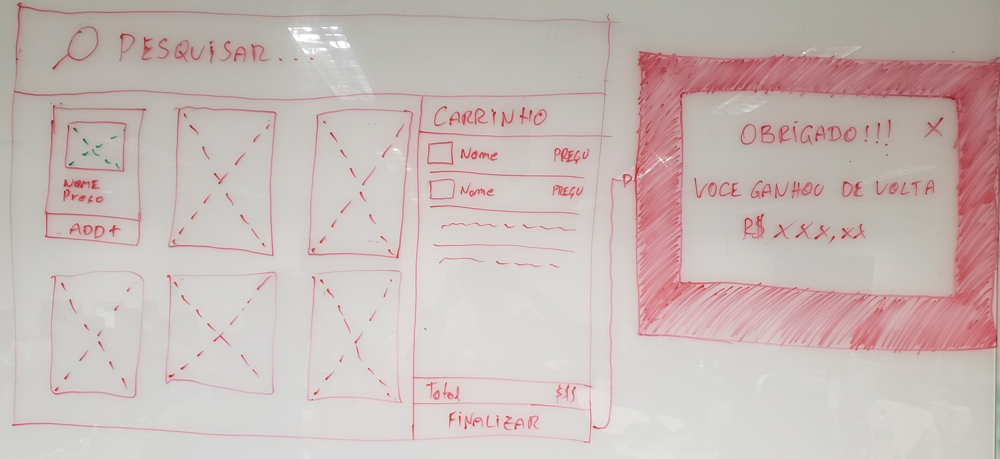

Parabéns pessoa, **nós escolhemos você** para a próxima etapa do nosso processo seletivo!

Aqui na B2W Digital estamos sempre em busca de pessoas que estejam dispostas a achar todas as insígnias para resolver um problema. E para isso estamos propondo a você um desafio, mas não se preocupe, você conseguirá fazê-lo sentado em sua cadeira.

Nós somos a holding de 4 das maiores lojas virtuais e marketplaces da América Latina. Sabendo disso, queremos que você vivencie a experiência de construir uma loja virtual, e nos mostre como você imaginaria ser uma loja de Pokémon.

Isso talvez não seja mais um mistério, mas atualmente tratamos as nossas lojas como uma base de código com 4 estilos diferentes.

Queremos saber como você faria isso no seu desafio, **desejamos no mínimo 2 lojas para 2 tipos(água, fogo, dragão, etc.) de Pokémon** com estilos diferentes, mantendo o mesmo comportamento.

Os Pokémon(sim, esse é o plural) deverão ser mostrados a partir da **[pokeapi](https://pokeapi.co/)([https://pokeapi.co/](https://pokeapi.co/))**, uma api com dados de todos os Pokémon *(ou quase todos)*. Após requisitar os Pokémon, os preços podem ser definidos aleatoriamente, só esteja preocupado em **manter a consistência entre o carrinho lateral e o preço mostrado no catálogo**.

Nosso time de designers sugeriu como uma loja virtual deveria se aparentar, e queremos ver a sua criatividade em jogo para transformar esses rabiscos em algo funcional.

Não se assuste! Nosso time imaginou muitas funcionalidades, mas você poderá fazer somente o elencado abaixo pois utilizaremos sua loja da mesma forma. O MVP consiste em:

- Catálogo de produtos
- Carrinho lateral
- Resumo do carrinho
- 2 lojas com estilos e tipos diferentes de Pokémon

Caso isso tudo seja pouco e você queira batalhar em outros ginásios, não se preocupe, está permitido fazer tudo o que sua imaginação permitir e nos impressionar. Abaixo segue outras ideias propostas nesse rabisco.

- Barra de busca para filtrar os Pokémon
- Botão de finalizar compra, reiniciando o processo de compra
- Modal de obrigado ao finalizar compra
- Salvar os dados da compra do usuário localmente para não perdê-las ao atualizar a página

Recomendamos a utilização da biblioteca ReactJS com o comando create-react-app, mas sinta-se livre para utilizar a tecnologia que preferir, mas não se esqueça que uma aplicação shiny é uma aplicação bem testada e que funcione em todos os tamanhos de tela.

Esperamos que você tenha gostado do desafio e que esteja ansioso para evoluir seus Pokémon conosco na B2W. Responda esse e-mail com quanto tempo você deseja para realizar o desafio e o que achou dele, queremos saber como podemos fazer melhor para conseguirmos os melhores treinadores no nosso time!